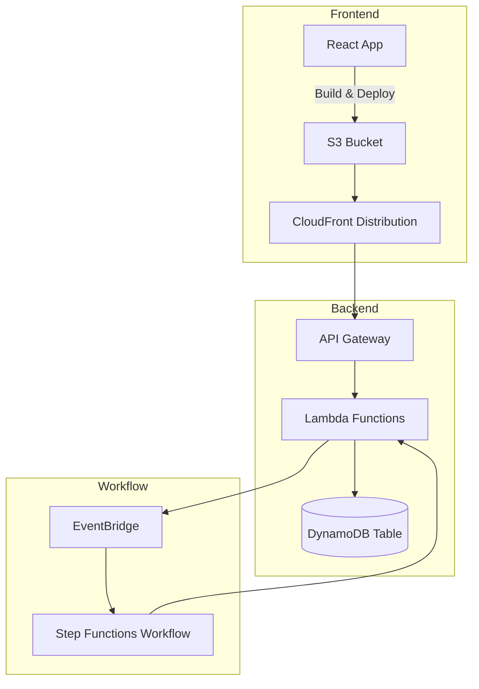

# CloudZone Assignment – Full Stack Cloud-Native Application

This project demonstrates a production‑like **cloud‑native system** for managing customer IDs.  
It combines a **serverless backend** with a **React frontend**, an **event‑driven workflow**, and AWS best practices.

---

## Components

### Backend

- AWS Lambda (Python 3.11)
- API Gateway (REST endpoints, secured with API Key)
- DynamoDB (table `customer_ids` with partition key `id`)
- Step Functions + EventBridge (workflow orchestration)
- CloudWatch (logs & metrics)

### Frontend

- React + TypeScript (Vite)
- Tailwind CSS v4
- Hosted on S3 + CloudFront (OAC enabled)
- Configurable API Base URL + API Key via `.env` and Settings panel

---

## Links

- **Frontend (CloudFront):** https://d2wjdcjivl50hy.cloudfront.net
- **API Gateway (prod stage):** https://nve5ktqo18.execute-api.eu-central-1.amazonaws.com/prod
- **Step Function ARN:** `arn:aws:states:eu-central-1:010255283398:stateMachine:customers-workflow`

---

## Architecture Diagram



---

## Getting Started

- [Frontend README](./frontend/README.md) → Dev, build, and deploy instructions
- [Backend README](./backend/README.md) → API usage, DynamoDB, Lambda, and workflow details

---

## Deployment Workflow

1. **Backend**

   - Package & deploy Lambda functions
   - Create DynamoDB table `customer_ids`
   - Configure API Gateway + Usage Plan (API Key)
   - Deploy Step Functions workflow

2. **Frontend**

   - `npm run build`
   - Sync build output to S3 with correct cache-control
   - Invalidate CloudFront distribution

3. **Testing**
   - Use provided curl / Postman examples
   - Verify CORS headers and API Key authentication
   - Confirm workflow execution in Step Functions console

---

## Monitoring & Observability

- **CloudWatch Logs** enabled on all Lambdas & Step Functions
- **Metrics & Alarms** configured for API Gateway & Lambda errors
- **Structured logging** (JSON format) in application code

---

## Known Limitations

- Authentication is API Key only (no IAM/OAuth/JWT)
- Deployment scripts are manual (no CI/CD pipeline yet)
- Workflow is simplified (validate → insert/log only)
- No automated integration tests, only unit tests for Lambdas

---

## Repository Structure

```
repo-root/
  README.md            # General overview of the project (tech stack, missions, how to run)

  backend/             # Backend code & docs
    README.md          # Backend documentation (Lambdas, API Gateway, DynamoDB, Step Functions, EventBridge, monitoring)

  frontend/            # Frontend code & docs
    README.md          # Frontend documentation (React app, build & deploy to S3/CloudFront, SPA routing)

  docs/                # Shared documentation
    diagrams/          # Architecture diagrams (backend, frontend, workflows)
    screenshots/       # Screenshots of executions, logs, alarms, deployed app

  infra/               # Infrastructure as Code (IaC), configs or deployment scripts
                       # (e.g., CloudFormation, SAM, Terraform, or helper scripts)

  backups/             # Backup files, previous versions, or exports
                       # (not part of main project, for local/dev use only)

  .gitignore           # Git ignore rules


```

---

## Screenshots

### Main UI

[](./frontend/src/assets/Screenshot%202025-09-20%20222428.png)
