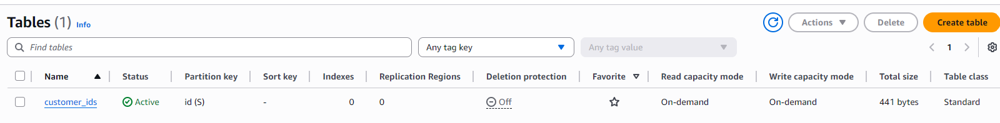
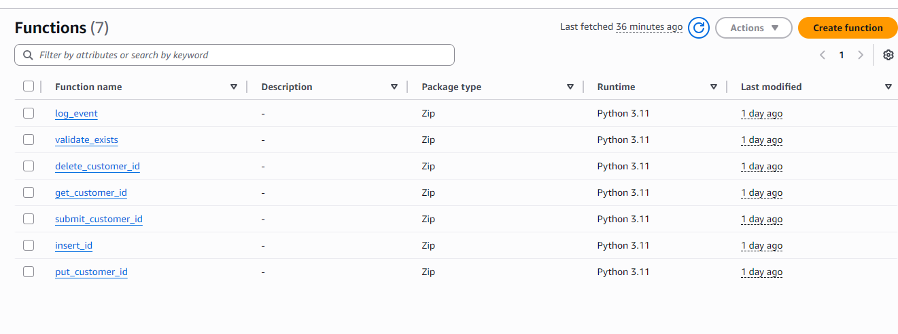
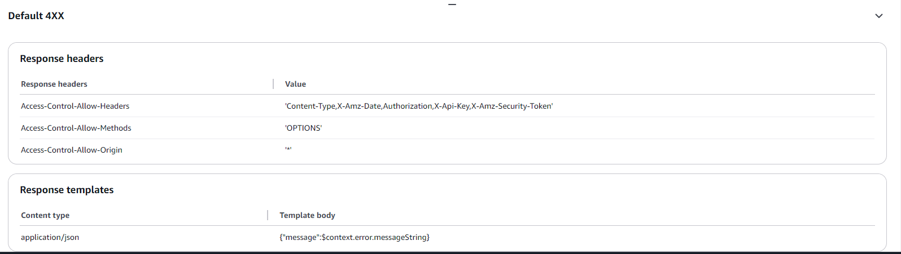
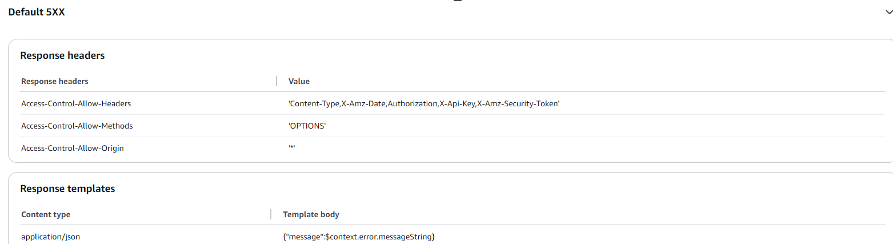
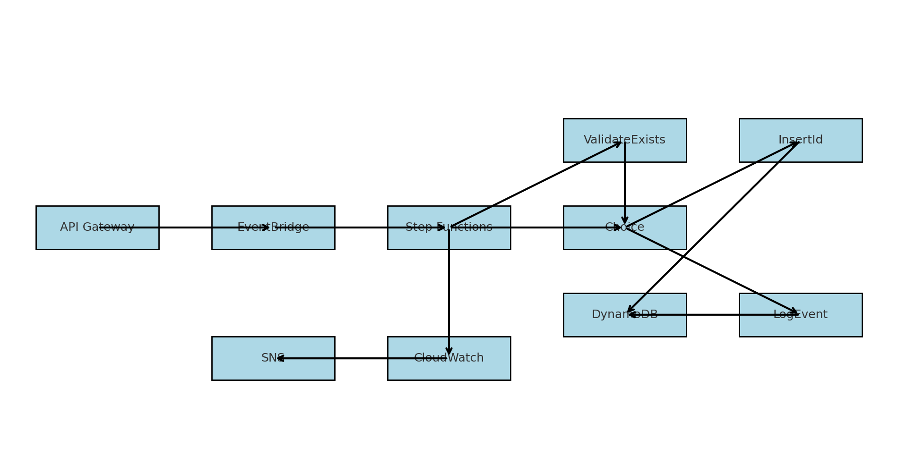
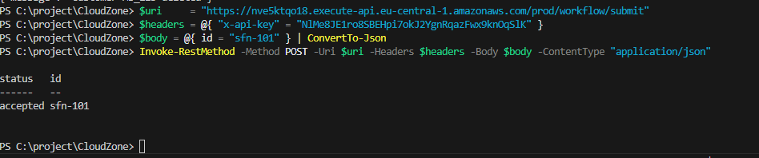
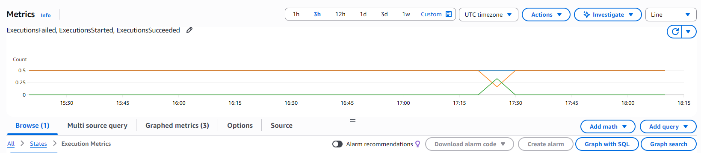
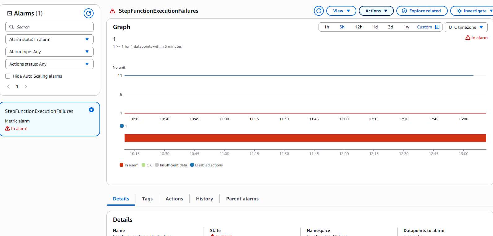
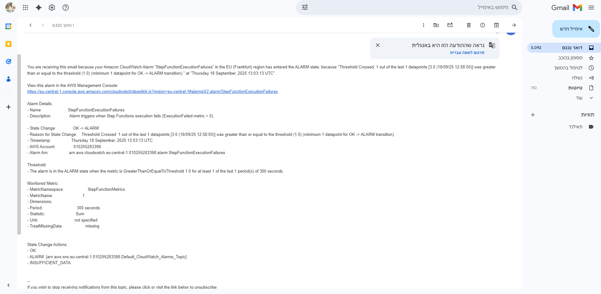

# Customer IDs Backend (AWS Lambda + API Gateway + DynamoDB)

Serverless backend providing a secure **REST API** to manage customer IDs, plus an **event‑driven workflow** with **Step Functions + EventBridge**, monitored by **CloudWatch**.

---

## Tech Stack

- **Python 3.11** (AWS Lambda)
- **API Gateway** (REST, API Key)
- **DynamoDB** (`customer_ids`, PK: `id`)
- **Step Functions + EventBridge** (orchestration & triggers)
- **CloudWatch** (logs, metrics, alarms)
- **pytest** (unit tests)

---

## Project Structure

```
backend/
  app/
    config.py        # settings & env
    logging.py       # structured logging
    errors.py        # domain exceptions
    http.py          # response helpers (CORS included)
    dynamodb_repo.py # DynamoDB repository
    validation.py    # input validation
  lambdas/
    get_customer_id/handler.py
    put_customer_id/handler.py
    delete_customer_id/handler.py
    validate_exists/handler.py
    log_event/handler.py
    insert_id/handler.py
  tests/
    test_get_customer_id.py
    test_put_customer_id.py
    test_delete_customer_id.py
    test_validate_exists.py
  docs/
    screenshots/   # CloudWatch, SFN, EventBridge, alarms
    diagrams/      # architecture
```

---

## DynamoDB

Create the table:

```bash
aws dynamodb create-table   --table-name customer_ids   --attribute-definitions AttributeName=id,AttributeType=S   --key-schema AttributeName=id,KeyType=HASH   --billing-mode PAY_PER_REQUEST   --region eu-central-1
```

Check status:

```bash
aws dynamodb describe-table   --table-name customer_ids   --region eu-central-1   --query "Table.TableStatus"
```


Sample ops:

```bash
aws dynamodb put-item    --table-name customer_ids --item file://item.json --region eu-central-1
aws dynamodb get-item    --table-name customer_ids --key '{"id":{"S":"user_123"}}' --region eu-central-1
aws dynamodb delete-item --table-name customer_ids --key '{"id":{"S":"user_123"}}' --region eu-central-1
```

##

**Table Name:** `customer_ids`  
**Partition Key:** `id (String)`

### CLI Commands

- Create table: [Paste command + output]
- Describe table: [Paste output]
- Example put/get/delete: [Paste outputs]

---

## Lambda Functions

List of functions:

- `put_customer_id` – insert ID
- `get_customer_id` – check ID
- `delete_customer_id` – delete ID
- `validate_exists` – helper for workflow
- `log_event` – log branch
- `insert_id` – insert branch
  

---

## API Contract

**Endpoints**

- `PUT    /customers/{id}` – insert new ID
- `GET    /customers/{id}` – check existence
- `DELETE /customers/{id}` – delete ID

**Headers**

- `x-api-key` NlMe8JE1ro8SBEHpi7okJ2YgnRqazFwx9knOqSlK
- `Content-Type: application/json` (for PUT with body)

**Examples**

```bash
# PUT create
curl -Method PUT "https://nve5ktqo18.execute-api.eu-central-1.amazonaws.com/prod/customers/test_123" -Headers @{ "x-api-key"="NlMe8JE1ro8SBEHpi7okJ2YgnRqazFwx9knOqSlK" }
curl -Method PUT "https://nve5ktqo18.execute-api.eu-central-1.amazonaws.com/prod/customers/12" -Headers @{ "x-api-key"="NlMe8JE1ro8SBEHpi7okJ2YgnRqazFwx9knOqSlK" }


# GET exists
curl -Method GET "https://nve5ktqo18.execute-api.eu-central-1.amazonaws.com/prod/customers/test_123" -Headers @{ "x-api-key"="NlMe8JE1ro8SBEHpi7okJ2YgnRqazFwx9knOqSlK" }
curl -Method GET "https://nve5ktqo18.execute-api.eu-central-1.amazonaws.com/prod/customers/test_127" -Headers @{ "x-api-key"="NlMe8JE1ro8SBEHpi7okJ2YgnRqazFwx9knOqSlK" }

# DELETE
curl -Method DELETE "https://nve5ktqo18.execute-api.eu-central-1.amazonaws.com/prod/customers/test_123" -Headers @{ "x-api-key"="NlMe8JE1ro8SBEHpi7okJ2YgnRqazFwx9knOqSlK" }
curl -Method DELETE "https://nve5ktqo18.execute-api.eu-central-1.amazonaws.com/prod/customers/test_127" -Headers @{ "x-api-key"="NlMe8JE1ro8SBEHpi7okJ2YgnRqazFwx9knOqSlK" }

```


---

## Lambda Deployment

Package:

```bash
zip -r backend/dist/backend_bundle.zip backend
```

Update functions:

```bash
REGION=eu-central-1
ZIP=backend/dist/backend_bundle.zip
for f in put_customer_id get_customer_id delete_customer_id validate_exists log_event insert_id; do
  aws lambda update-function-code --function-name "$f" --zip-file "fileb://$ZIP" --region "$REGION"
done
```

---

## 🔐 API Gateway Security

- **API Key required** – all requests must include `x-api-key` header.
- **Usage Plan** – attached to the `prod` stage:
  - Rate limit: **10 requests/second**
  - Burst limit: **5 requests**
- **Throttling** – prevents abuse and DoS.
- **CORS enabled** – for `GET, PUT, DELETE, OPTIONS` with headers `Content-Type, x-api-key`.

📸 Screenshot: API Gateway → Usage Plan → Stage attached to `prod`.


---

## 🌐 CORS

- **OPTIONS method** added to `/customers/{id}` with Integration Response headers:
  - `Access-Control-Allow-Origin: *`
  - `Access-Control-Allow-Headers: Content-Type, x-api-key`
  - `Access-Control-Allow-Methods: GET, PUT, DELETE, OPTIONS`


- **Gateway Responses** (`DEFAULT_4XX` and `DEFAULT_5XX`) updated to include:
  - `Access-Control-Allow-Origin: *`

📸 Screenshot: Gateway Response (DEFAULT_4XX) showing `Access-Control-Allow-Origin`

📸 Screenshot: Gateway Response (DEFAULT_5XX) showing `Access-Control-Allow-Origin`



---

## Mission 3 – Event‑Driven Workflow

### Architecture

Flow: **API Gateway → EventBridge → Step Functions → (ValidateExists → Choice → [LogEvent | InsertId]) → DynamoDB → CloudWatch → SNS**



### State Machine (ASL)

File: `backend/doc/customers-workflow.asl.json`

### Flow

`ValidateExists → Choice → [LogEvent | InsertId]`

### Executions

- Example input (new ID) → Insert path.
- Example input (existing ID) → LogEvent path.
- Example invalid input → Failure.


## ⏰ EventBridge Trigger

The workflow is triggered by an **EventBridge Rule** listening for customer events.

- **Rule name:** CustomerIdSubmitted-to-Workflow
- **Source:** app.customers
- **Detail type:** CustomerIdSubmitted
- **Target:** Step Function `customers-workflow`
- **Status:** Enabled ✅

📸 EventBridge Rule showing event pattern trigger:

📸 Rule list (showing the rule is enabled)  


📸 Rule target (Step Functions workflow as target)  


Rule pattern:

```json
{ "source": ["customer.api"], "detail-type": ["CustomerCreated"] }
```

---

## 📊 Monitoring & Logs

Monitoring was implemented using AWS CloudWatch to provide observability across the system:

- **CloudWatch Logs**:  
   Enabled for all Lambda functions with structured JSON logging.  
   📸 See example from `insert_id` Lambda function log group.
  

- **CloudWatch Metrics**:  
  Enabled for the Step Functions workflow (`customers-workflow`) under the `AWS/States` namespace.  
  Key metrics tracked:

  - `ExecutionsStarted` – number of workflow executions triggered
  - `ExecutionsSucceeded` – successful workflow runs
  - `ExecutionsFailed` – failed workflow runs  
    📸 See screenshot of Metrics dashboard showing workflow executions.
    

- **CloudWatch Alarms**:  
  Configured on the `ExecutionsFailed` metric to notify when failures occur.  
  

This setup ensures that both function-level logs and workflow-level metrics are monitored, with proactive alerting on failures.

**EMAIL**

- Topic: `arn:aws:sns:eu-central-1:<ACCOUNT_ID>:alerts` (confirm email subscription)
  

---

## Testing & Validation

**Manual execution**

```bash
aws stepfunctions start-execution   --state-machine-arn "<STATE_MACHINE_ARN>"   --input '{"id":"demo-123"}'
```

Results:

- First run → Insert branch
- Second run (same id) → LogEvent branch
- Invalid input → Failed execution → Alarm → Email

---

## Troubleshooting (Quick)

- **403** → missing/invalid `x-api-key` or Usage Plan not attached
- **CORS** → ensure OPTIONS + Gateway Responses (4XX/5XX) include CORS headers
- **404** → path mismatch (`/customers/{id}`)
- **Validation** → `id` must be non-empty string

---
