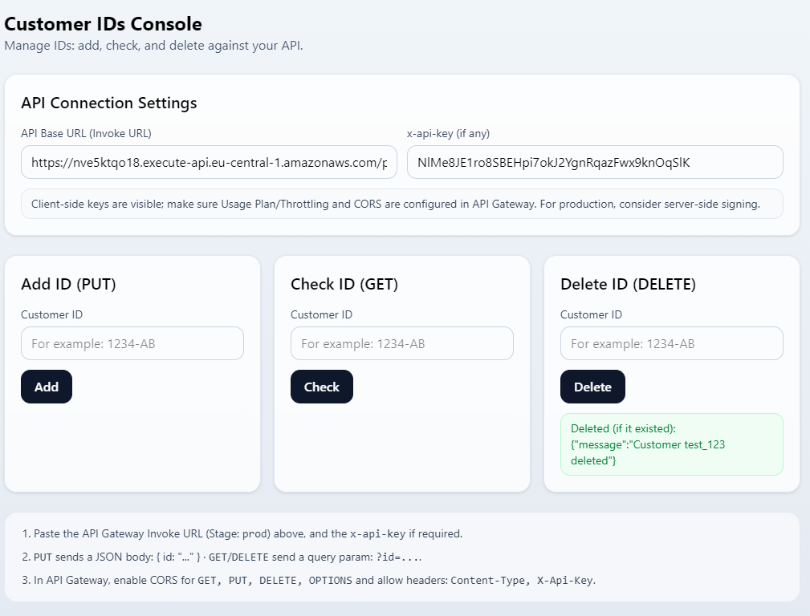

# Customer IDs Frontend (React + TypeScript + Tailwind v4)

One‑page console to **add / check / delete** customer IDs against your AWS API Gateway + Lambda backend.

---

## Tech Stack

- Vite + React + TypeScript
- Tailwind CSS v4 (zero‑config via `@tailwindcss/postcss`)
- react-hook-form + zod (validation)
- react-hot-toast (feedback)

---

## Quick Start

```bash
# 1) Install deps
npm i

# 2) Dev server
npm run dev
# open the URL printed by Vite (e.g. http://localhost:5173)
```

---

## Deployment Links

- **CloudFront URL:** [https://d2wjdcjivl50hy.cloudfront.net](https://d2wjdcjivl50hy.cloudfront.net)
- **API Gateway (Invoke URL / prod):** [https://nve5ktqo18.execute-api.eu-central-1.amazonaws.com/prod](https://nve5ktqo18.execute-api.eu-central-1.amazonaws.com/prod)

---

### How it’s used in code

`src/App.tsx` reads:

```ts
const [baseUrl, setBaseUrl] = useLocalStorage(
  "api_base_url",
  import.meta.env.VITE_DEFAULT_API_BASE_URL || ""
);
const [apiKey, setApiKey] = useLocalStorage(
  "api_key",
  import.meta.env.VITE_DEFAULT_API_KEY || ""
);
```

Build‑time values are used **only as defaults**; users can change them in Settings, persisted in localStorage.

---

## API Contract

This frontend currently calls **path‑parameter** routes (matching your backend):

- `PUT    /customers/{id}` → add ID
- `GET    /customers/{id}` → check existence
- `DELETE /customers/{id}` → delete ID

Required headers from the browser:

- `x-api-key` (if API Key is enabled)
- `Content-Type: application/json` (for PUT only when sending a body)

We centralize these headers in backend helper `resp(...)` so every Lambda response includes them.

---

## Deploy (S3 + CloudFront + OAC)

1. **Build**

   ```bash
   npm run build
   ```

2. **S3 bucket** (private) and upload:

   ```bash
   aws s3api create-bucket --bucket <unique-bucket-name> --region eu-central-1 --create-bucket-configuration LocationConstraint=eu-central-1
   aws s3 sync dist/ s3://<unique-bucket-name> --delete
   ```

3. **CloudFront** distribution:

   - Origin: the S3 bucket
   - **Origin Access Control (OAC)** enabled and attached
   - Default root object: `index.html`
   - Accept suggested bucket policy for OAC

4. (Optional SPA) Map 403/404 → `index.html` with 200 response.

5. **Invalidate cache** after each deploy:

   ```bash
   aws cloudfront create-invalidation --distribution-id <DIST_ID> --paths "/*"
   ```

## Testing (cURL)

```bash
# Preflight (CORS)
curl -i -X OPTIONS "https://nve5ktqo18.execute-api.eu-central-1.amazonaws.com/prod/customers/AB_123"   -H "Origin: https://d2wjdcjivl50hy.cloudfront.net"   -H "Access-Control-Request-Method: PUT"   -H "Access-Control-Request-Headers: Content-Type,X-Api-Key"

# PUT – add ID
curl.exe -i -X PUT "https://nve5ktqo18.execute-api.eu-central-1.amazonaws.com/prod/customers/AB_123" `
  -H "Origin: http://localhost:5173" `
  -H "x-api-key: NlMe8I2fRoS8BEHpi7ok2YgnRqazFwx9KnQqS1K"

# GET – check existence
curl.exe -i -X GET "https://nve5ktqo18.execute-api.eu-central-1.amazonaws.com/prod/customers/AB_123" `
  -H "Origin: http://localhost:5173" `
  -H "x-api-key: NlMe8I2fRoS8BEHpi7ok2YgnRqazFwx9KnQqS1K"

# DELETE – remove ID
curl.exe -i -X DELETE "https://nve5ktqo18.execute-api.eu-central-1.amazonaws.com/prod/customers/AB_123" `
  -H "Origin: http://localhost:5173" `
  -H "x-api-key: NlMe8I2fRoS8BEHpi7ok2YgnRqazFwx9KnQqS1K"

```




---

## Project Structure

```
src/
  lib/
    api.ts               # fetch client (GET/PUT/DELETE)
    types.ts             # shared types
    useLocalStorage.ts   # helper for Settings
    validation.ts        # zod schemas
  components/ui/
    Button.tsx Card.tsx Input.tsx Status.tsx
  features/
    settings/Settings.tsx
    add/AddIdForm.tsx
    check/CheckIdForm.tsx
    delete/DeleteIdForm.tsx
  App.tsx
  index.css              # @import "tailwindcss";
postcss.config.js        # { plugins: { '@tailwindcss/postcss': {} } }
```

---

## Troubleshooting

- **CORS error in browser**: verify OPTIONS exists on `/customers/{id}` and real responses include the headers. Also configure API Gateway **Gateway Responses** for DEFAULT_4XX/5XX.
- **403 from API Gateway**: API Key missing/invalid or missing Usage Plan on stage.
- **404**: wrong path (`/customers/{id}` vs `/customer`). Ensure frontend `api.ts` matches your backend.
- **Env defaults ignored**: `.env` values are only defaults; you can override in Settings (localStorage). Clear localStorage to reapply defaults.

## Screenshots (to include)

- **Settings** panel filled with Invoke URL + (masked) API Key
- **Add / Check / Delete** success & error states (toasts + status)
- **CloudFront URL** opened and rendering the app

---

### SPA Routing (Optional)

To support client-side routing (React SPA), CloudFront **custom error pages** were configured:

- **403 → /index.html (200)**
- **404 → /index.html (200)**

This ensures that any non-existing path (e.g. `/settings`, `/profile`) returns the main `index.html` and React Router handles the route correctly.  
Without this, CloudFront would return the raw S3 XML error (`NoSuchKey`).


